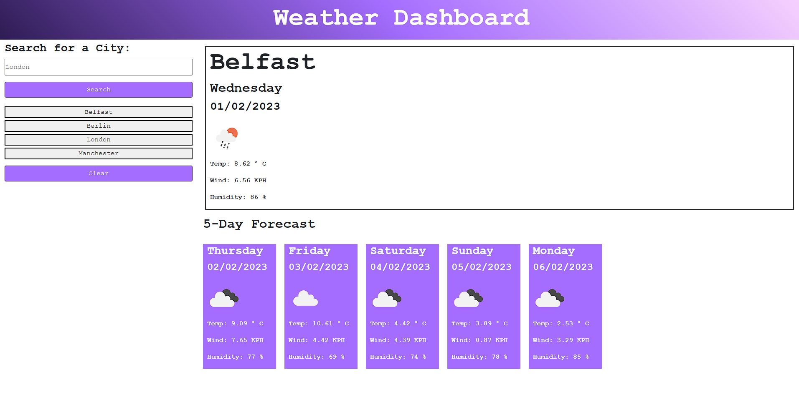

# weather-dashboard
A simple browser based weather dashboard, using two APIs to retrieve a 5 Day Weather Forecast for a user defined city.

## Description

The following image shows the web application's appearance and functionality:
 

 

A simple browser based weather dashboard, using two APIs to retrieve a 5 Day Weather Forecast for a user defined city.
This project runs in the browser and features dynamically updated HTML and CSS. LocalStorage is used to store persistent data in the form of city data, which in turn is used to populate a user history, to allow weather data for previously searched cities to be quickly accessed via buttons.

The application:

* Presents a weather dashboard with a search form input for city name.
  * When a user searches for a city they are presented with current and future (5 day forecast) conditions for that city and that city is added to the search history
  * User input is validated, prompting for a valid city name if failed
  * When a user views the current weather conditions for that city they are presented with:
    * The city name
    * The date
    * An icon representation of weather conditions
    * The temperature
    * The humidity
    * The wind speed
  * When a user views future weather conditions for that city they are presented with a 5-day forecast that displays:
    * The date
    * An icon representation of weather conditions
    * The temperature
    * The humidity
  * When a user clicks on a city in the search history they are again presented with current and future conditions for that city
  * When a user clicks the Clear History button, their search history is cleared and the page is cleared

## Table of Contents

- [Installation](#installation)
- [Usage](#usage)
- [Credits](#credits)
- [License](#license)

## Installation

N/A

## Usage
Simply enter a valid city name to retrieve the weather conditions today and a 5 day forecast, or click a previously searched city name from the history to get current and future conditions for that city.

The page is deployed via GitHub pages:
 
https://peafunk3000.github.io/weather-dashboard/
 

The repository for this project can be found on my GitHub:
 
https://github.com/PeaFunk3000/weather-dashboard/
 

## Credits

N/A

## License

MIT License

